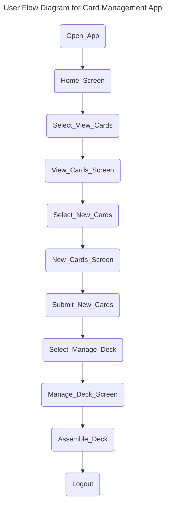
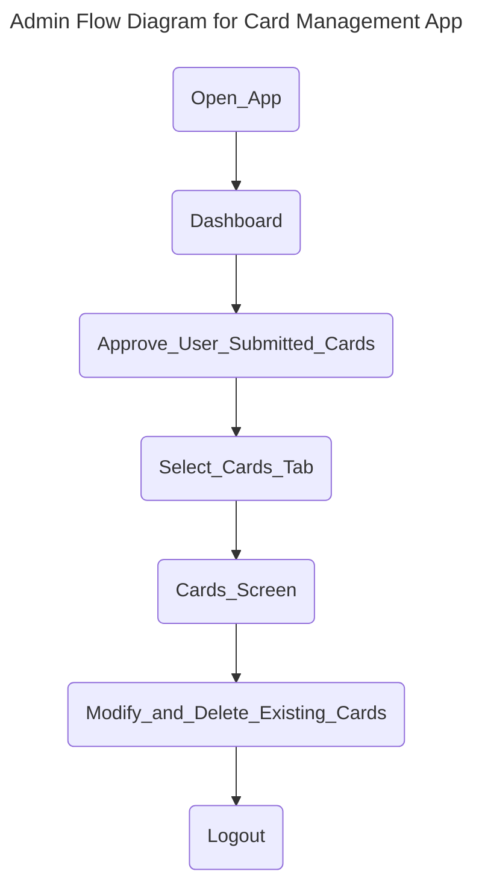

```mermaid

flowchart TD
    A[Front-end] --> B[Barcened]
    A --> C[M1]
    
    D[Main backboard] --> E[Backbone]
    D --> F[Process(s)]
    D --> G[decision]
    
    H[Dontabase] --> I[Module Load]
    H --> J[Module Load]

```
