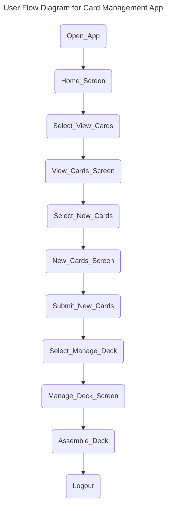
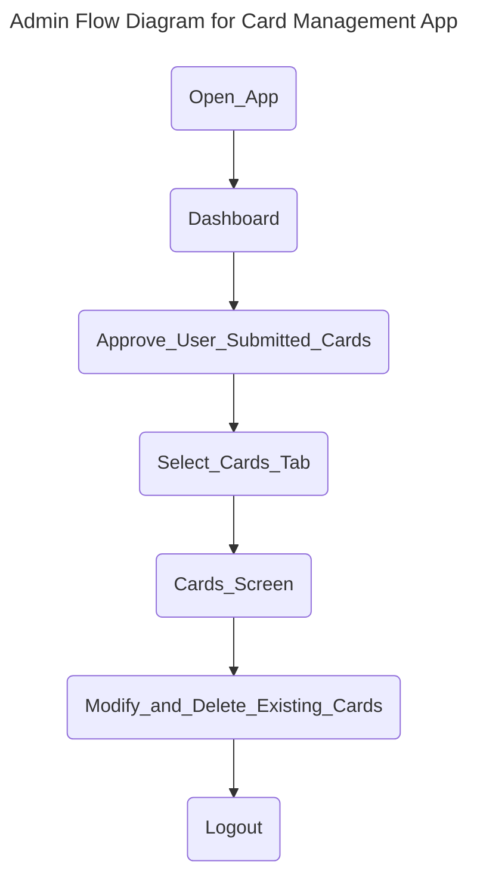
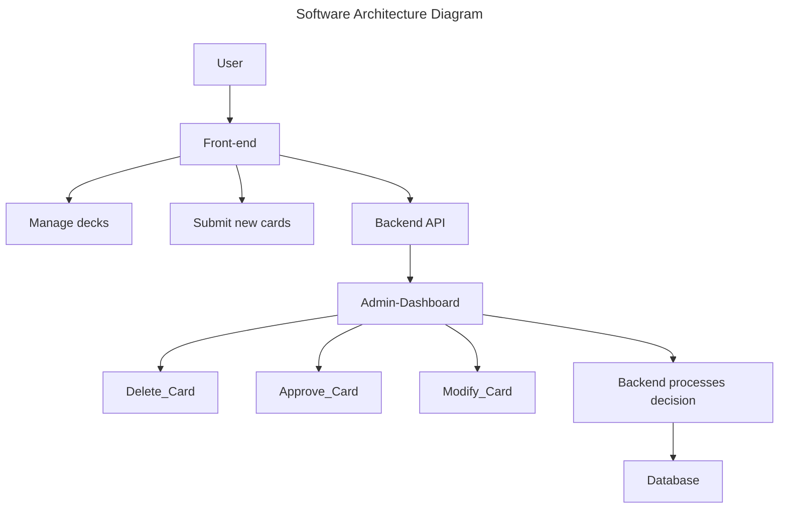
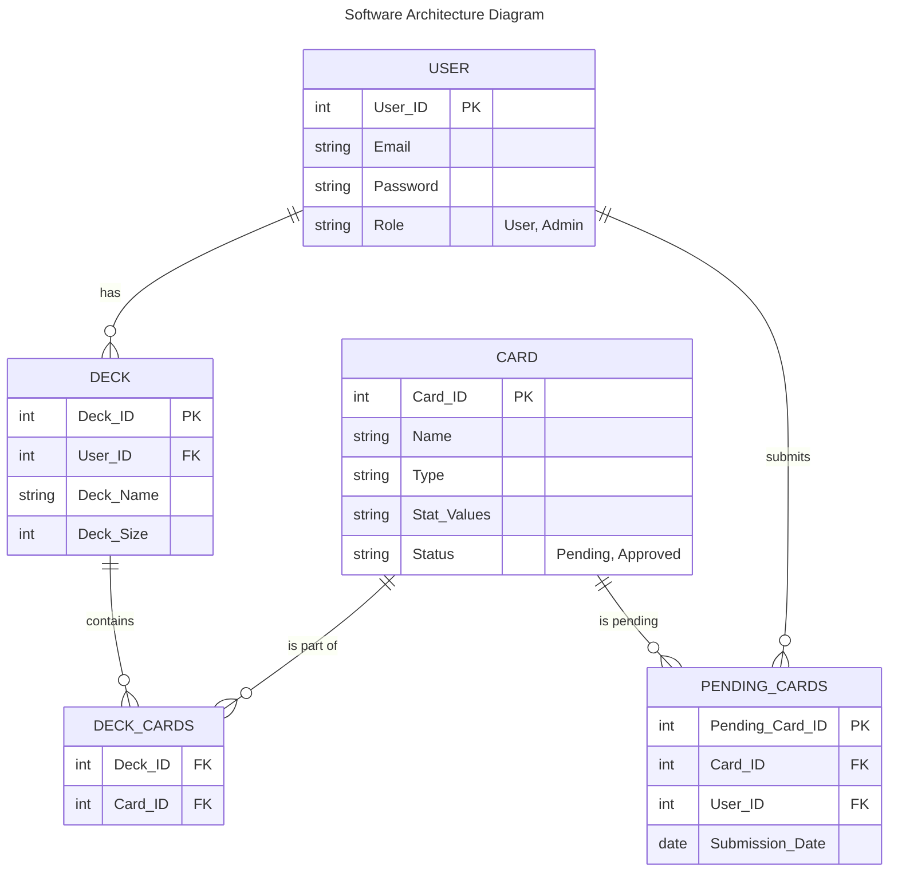

| **Endpoint**                         | **Method** | **Description**                                   | **Authentication** |
|--------------------------------------|-----------|-------------------------------------------------|--------------------|
| `/api/cards`                         | `GET`     | Retrieve all Pokémon cards                      | User               |
| `/api/cards/{id}`                     | `GET`     | Retrieve details of a specific card by ID      | User              |
| `/api/cards/submit`                   | `POST`    | Submit a new Pokémon card for approval         | User               |
| `/api/cards/{id}/approve`             | `PUT`     | Approve a user-submitted card                  | Admin              |
| `/api/cards`                          | `POST`    | Add a new Pokémon card                         | Admin              |
| `/api/cards/{id}`                     | `PUT`     | Modify an existing Pokémon card                | Admin              |
| `/api/cards/{id}`                     | `DELETE`  | Delete a Pokémon card                          | Admin              |
| `/api/decks`                          | `GET`     | Retrieve all decks of the logged-in user       | User               |
| `/api/decks/{id}`                     | `GET`     | Retrieve details of a specific deck           | User               |
| `/api/decks`                          | `POST`    | Create a new deck                             | User               |
| `/api/decks/{id}`                     | `PUT`     | Modify an existing deck                       | User               |
| `/api/decks/{id}`                     | `DELETE`  | Delete a deck                                | User               |
| `/api/decks/{id}/add-card`            | `POST`    | Add a card to a deck                         | User               |
| `/api/decks/{id}/remove-card/{cardId}` | `DELETE`  | Remove a card from a deck                    | User               |
| `/api/auth/login`                     | `POST`    | User logins                                  | Admin               |
| `/api/auth/register`                  | `POST`    | Register a new user                          | Admin               |
| `/api/auth/logout`                    | `POST`    | Logout current session                       | Admin               |

