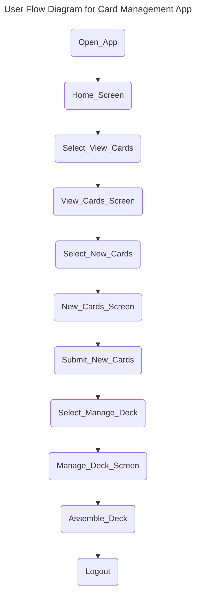
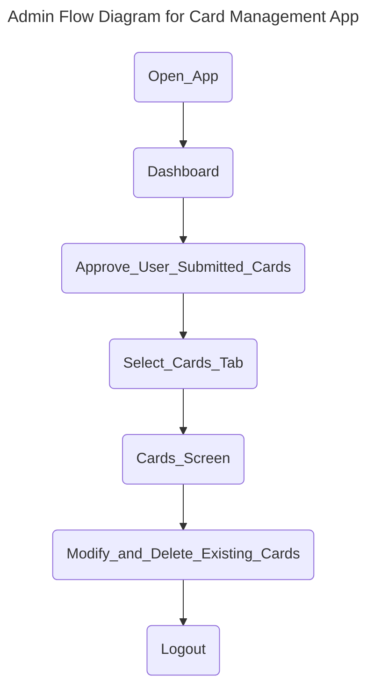
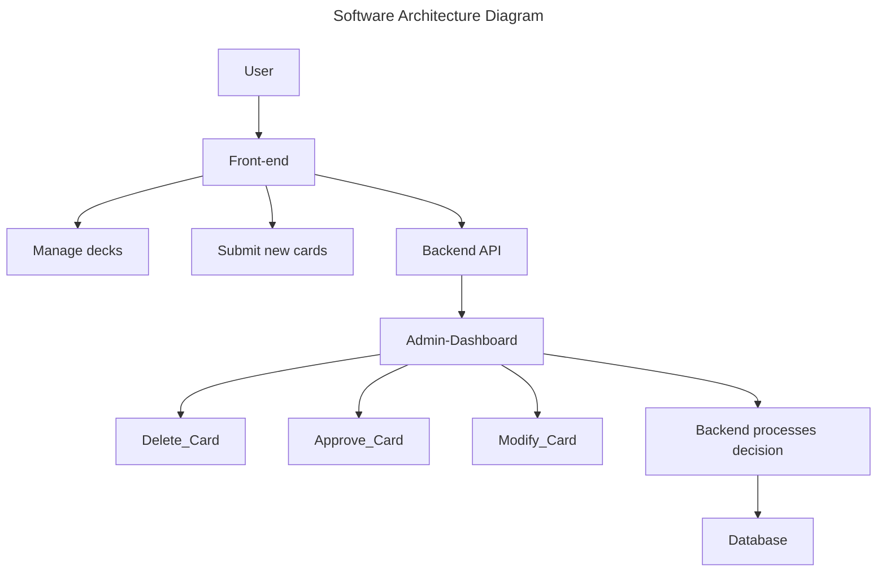

```mermaid
---
title: User Flow Diagram for Card Management App
---

%% User Flow Diagram
flowchart TD
    A(Open_App) --> B(Home_Screen)
    B --> C(Select_View_Cards)
    C --> D(View_Cards_Screen)
    D --> E(Select_New_Cards)
    E --> F(New_Cards_Screen)
    F --> G(Submit_New_Cards)
    G --> H(Select_Manage_Deck)
    H --> I(Manage_Deck_Screen)
    I --> J(Assemble_Deck)
    J --> K(Logout)  

```

```mermaid
---
title: Admin Flow Diagram for Card Management App
---
%% Admin Flow Diagram
flowchart TD
    A2(Open_App) --> B2(Dashboard)
    B2 --> C2(Approve_User_Submitted_Cards)
    C2 --> D2(Select_Cards_Tab)
    D2 --> E2(Cards_Screen)
    E2 --> F2(Modify_and_Delete_Existing_Cards)
    F2 --> G2(Logout)
```

```mermaid
---
title: Software Architecture Diagram
---

flowchart TD
    A1[User] --> A[Front-end]
    
    A --> B[Manage decks]
    A --> C[Submit new cards]
    
    A --> D[Backend API]
    
    D --> E[Admin-Dashboard]
    
    E --> F[Delete_Card]
    E --> G[Approve_Card]
    E --> H[Modify_Card]

    E --> I[Backend processes decision]
    
    I --> J[Database]


```
